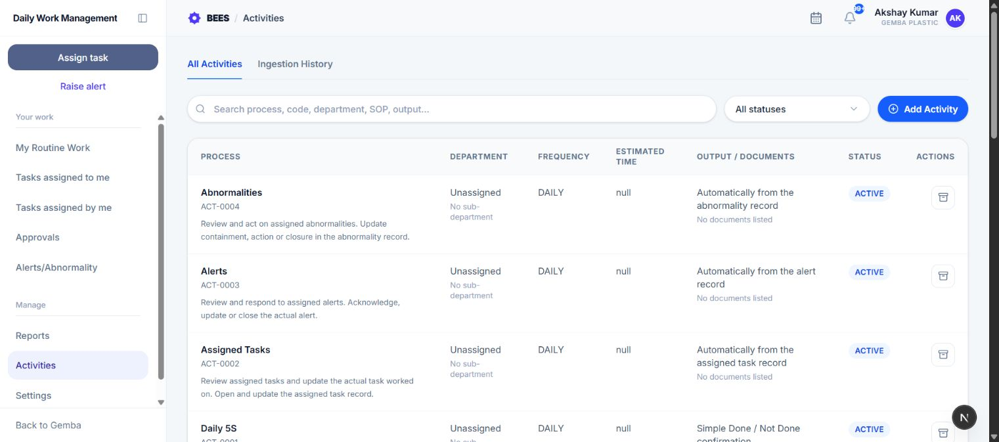
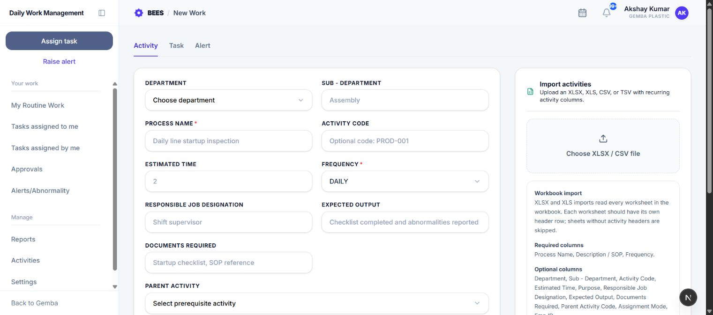

# Activities

Activities is the master library for reusable standard work. An activity can be assigned to employees as routine work, selected while creating an ad hoc task, and linked to a prerequisite activity.

## 1. Who can manage activities

Management, Admin, Super Admin, HR, and HOD users can create activities through the API and activity form. The Activity master list and archive controls are currently shown to Management, Admin, Super Admin, and HR users.

## 2. Browse the activity master

Open **Activities** from the DWMS Manage menu. Use:

- **All Activities** to search and maintain master records;
- **Ingestion History** to audit bulk imports;
- the status filter for Active or Archived records;
- search across process name, code, department, SOP, output, purpose, and required documents.

The table shows Process, Department, Frequency, Estimated Time, Output/Documents, Status, and actions. Select a row to open the full activity detail.

## 3. Create an activity

Select **Add Activity**, then open the Activity tab if needed. Complete the fields that define the standard work:

- **Department / Sub-Department:** Places the standard work in its operating area.
- **Process Name:** Required name of the activity.
- **Activity Code:** Optional reusable identifier; useful for imports and relationships.
- **Estimated Time:** Whole-number completion allowance.
- **Frequency:** Daily, Weekly, Monthly, Quarterly, or Yearly schedule.
- **Responsible Job Designation:** Job title used to find applicable employees.
- **Expected Output:** Result that proves the activity succeeded.
- **Documents Required:** Evidence expected at completion.
- **Parent Activity:** Optional same-frequency prerequisite.
- **Description / SOP:** Required standard method or instructions.
- **Purpose:** Why the activity exists and what risk it controls.

Select **Create activity** after completing the required Process Name, Frequency, and Description/SOP.

## 4. Parent and child relationships

An activity can have one parent activity. The parent picker offers active activities with the same frequency. The relationship forms a prerequisite chain.

When matching task occurrences are generated, the child task cannot progress until its parent occurrence for that schedule is Done. Activity and task detail pages visualize the chain and provide direct links.

## 5. Activity details

The detail page shows:

- company unit, department, sub-department, Gemba section, and process area;
- frequency, estimated time, and effective date;
- SOP, purpose, trigger, expected output, evidence, and remarks;
- responsible employee and designation;
- parent, children, and full activity relation chain.

Use the status badge to distinguish Active and Archived records.

## 6. Archive an activity

Select the Archive action in the master list. Archived activities remain available for history but cannot be selected for new tasks, used as an active prerequisite, or assigned as new routine work.

Archiving does not delete past task occurrences or their audit history.

## 7. Create a task from an activity

In Assign Task, select **Create from activity** and choose an active activity. DWMS carries the activity title, SOP, evidence requirement, and relationship context into the task while keeping a link to the master record.

The activity itself is not changed by creating the task.

## 8. Import activities

The Activity form accepts XLSX, XLS, CSV, TSV, or text tabular files. It reads every worksheet that contains recognizable activity headers.

At minimum, each valid row needs **Process Name** and **Description / SOP**. Supported columns include Department, Sub-Department, Activity Code, Estimated Time, Frequency, Responsible Job Designation, Expected Output, Documents Required, Assignment Mode, Emp ID, and Parent Activity Code.

Up to 500 rows can be submitted in one ingestion.

## 9. Import assignment modes

- **Individual:** Assign using the employee code in Emp ID.
- **All Users:** Assign the activity to all applicable users.
- **All Management:** Assign to management users.
- **All HOD:** Assign to department heads.

Parent Activity Code connects imported work to an existing or imported prerequisite code. Codes and employee identifiers should be unique and accurate.

## 10. Import results and failures

After import, DWMS reports created activities, assigned users, and failed rows. If rows fail, select **Download failed rows** to obtain a CSV containing worksheet, source row, error reason, and original values.

Open **Ingestion History** to see file name, uploader, total rows, created count, declined count, status, and upload time. Open an ingestion to search rows and filter by Created or Failed. Each row shows its activity, employee code, failure reason, and whether an activity or task was linked.

Sheets without recognizable activity headers are skipped and named in the result message.
