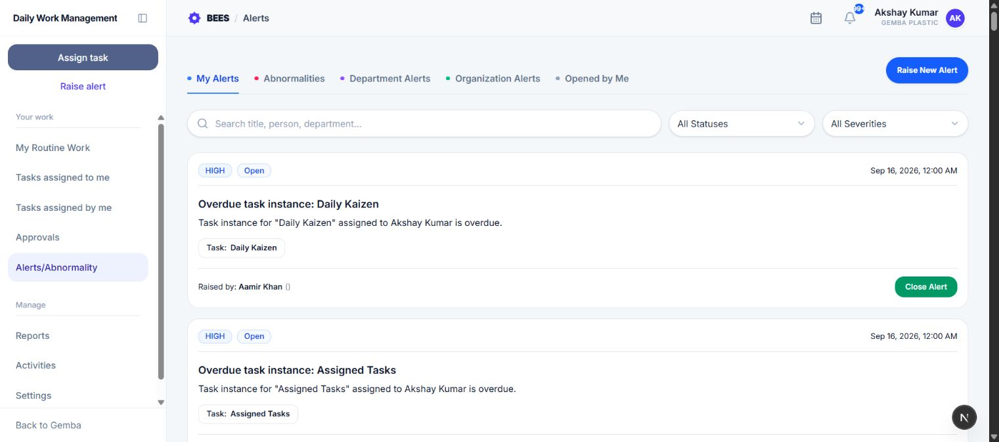
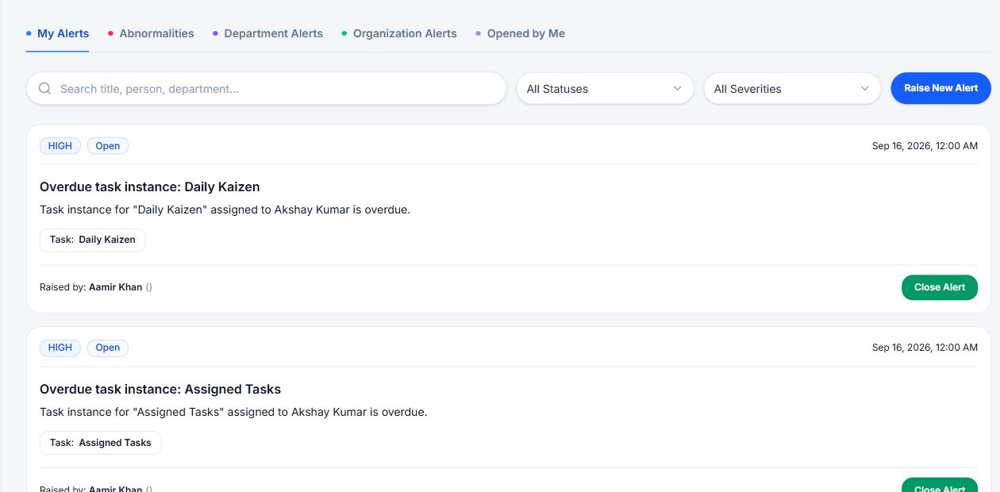
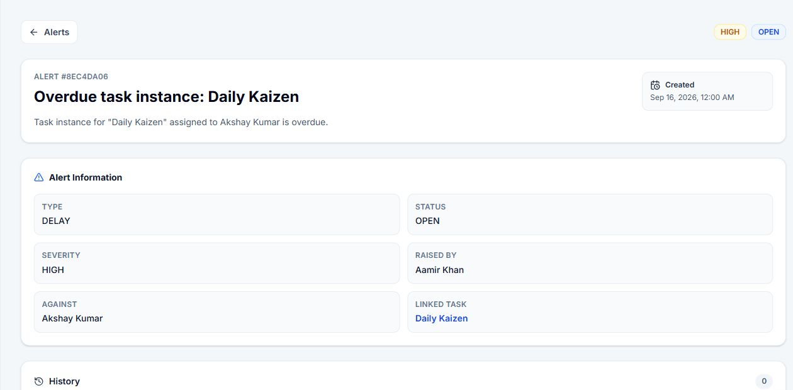

# Alerts / Abnormality

Alerts / Abnormality tracks operational issues from reporting through corrective action, escalation, closure, and automatic abnormality creation.

## 1. Open the workspace

Select **Alerts/Abnormality** in Daily Work Management. Use **Raise New Alert** to record a new issue. What you can see depends on your role, reporting relationships, department, and the Employee alert view setting.

## 2. Use the tabs

- **My Alerts:** Alerts for which you are the person or task owner responsible for action.
- **Abnormalities:** Separate abnormality records created by DWMS and linked to a source alert.
- **Department Alerts:** Alerts linked to a department.
- **Organization Alerts:** General alerts without a person, task, or department target.
- **Opened by Me:** Alerts you raised.

The tabs operate on the alerts already visible to you. Management receives organization visibility. HOD visibility is at least department level and can become organization-wide when configured. Regular employees use the configured Own, Department, or Organization view level.

> **Start here:** Open **My Alerts** first. These are the issues most likely to need your action. Deal with Critical alerts before High and Medium alerts, then use the other tabs for wider team awareness.

## 3. Search and filter

Search by alert title, person, or department. Filter by status and severity.

- **Open:** Reported and awaiting corrective action.
- **In Progress:** Corrective action or closure review is underway.
- **Escalated:** The issue has been escalated for additional attention.
- **Closed:** The issue was accepted as resolved.

Severity is Medium, High, or Critical.

## 4. Read an alert card

Cards identify the alert title, description, severity, status, raiser, responsible person or task, department, timestamps, and abnormality context. Select a card to open complete details.

When you open an alert, answer these questions before acting:

1. **What happened?** Read the title and description.
2. **How urgent is it?** Check the severity in the top-right corner.
3. **Who owns the next action?** Check **Against**, the responsible person, or the department.
4. **Is work already linked?** Open **Linked task** when shown.
5. **What has already happened?** Read History and comments before adding a new response.

The detail page contains Alert Information, History and comments, Resolution, Corrective Action, related task links, and source/created abnormality links when present.

## 5. Respond with corrective action

The responsible employee, Management, or HOD can respond to an Open alert. Enter the corrective action taken or planned and submit it. The alert moves to In Progress and the action is preserved in its record.

A useful response states containment, root cause or current finding, permanent action, owner, and expected completion.

**Plain-language example:** “Stopped the leaking pump and placed a spill tray at 10:15. Maintenance found a loose seal and will replace it by 2:00 PM. Production is using Pump 2 until the repair is checked.” This is more useful than “Issue attended.”

## 6. Add comments

Open the alert and use **Add comment** to record investigation notes, questions, handoffs, or evidence references. Comments include their author and time and become part of the alert history.

## 7. Request closure

The responsible person can request closure for an open issue after entering a required closure note.

1. Confirm the corrective action and outcome.
2. Enter a closure note that explains why the issue is resolved.
3. Submit the request.

The alert stays In Progress with Closure Approval Pending and appears in the approver's Approvals workspace.

## 8. Approve, reject, or close

An authorized closure approver can:

- **Approve:** Records the required approval comment, closes the alert, and sets its resolved time.
- **Reject:** Records the required rejection reason and returns the alert to In Progress for more action.
- **Close directly:** Authorized users can enter a required closure note and close an eligible alert without a separate pending request.

All decisions remain in the alert history.

## 9. Automatic abnormalities

DWMS creates a separate abnormality record in either of these cases:

- **No corrective action within the configured window:** An unresolved alert passes the time limit for its severity, as set by the organization in Settings.
- **Repeated overdue task:** The same task assigned to the same owner produces three overdue task-instance alerts.

The source alert and created abnormality link to each other in the detail view. Manually raised alerts are not currently grouped for the three-report rule; that recurrence path applies to overdue task instances.

## 10. Escalation and task-linked actions

Authorized workflows can remind the responsible employee, escalate an alert, or reassign the owner of a linked task. Reminders are protected from duplicate sends to the same employee. Reassignment applies only when the alert is linked to a task instance.

Completing the delayed task can close its related system delay alerts. Manual abnormal-situation alerts continue through their own corrective-action and closure process.

## 11. Visibility examples

- **Own:** Alerts raised by you, addressed to you, sent to you as a recipient, or linked to your task.
- **Department:** Own alerts plus department alerts and alerts involving your reportees.
- **Organization:** All alerts in the current organization.

Filters never grant additional access; they only narrow the alerts returned for your permitted view.
