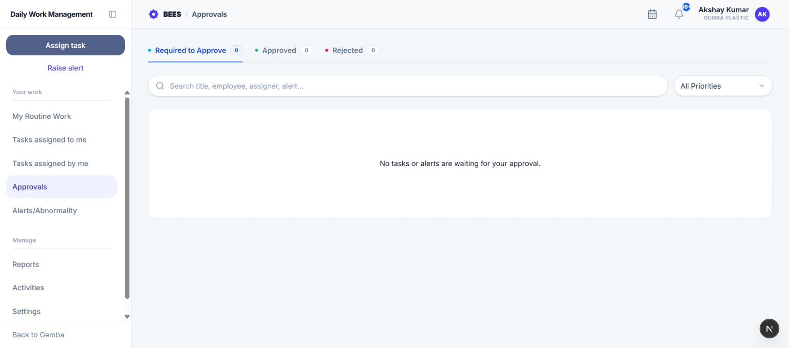

# Approvals

Approvals combines task-completion reviews and alert-closure reviews assigned to the signed-in approver.

## 1. What appears here

- A task appears after its owner submits Done and DWMS resolves you as its approver.
- An alert appears after its responsible person requests closure and you are the closure approver.

Items are separated by type on each card, but reviewed from the same workspace.

## 2. Use the tabs

- **Required to Approve:** Task completions and alert closures waiting for your decision.
- **Approved:** Items you approved.
- **Rejected:** Items you rejected.

Each count includes both tasks and alerts.

## 3. Find an item

Search by title, employee, assigner, or alert details. Filter by **Critical**, **High**, or **Medium**; for tasks this is priority, and for alerts it is severity.

Task cards show the submitter, assigner, due date, description, and completion attachment. Alert cards show the closure requester, alert raiser, request date, description, and severity. Select a card to open its complete history before deciding.

## 4. Approve a task completion

1. Review the task instructions, status history, completion note, and submitted file.
2. Select **Approve**.
3. Enter the required approval comment.
4. Confirm the decision.

The task becomes Done with 100% completion. DWMS records the decision in history and notifies the owner and assigner, except the person making the decision.

## 5. Reject a task completion

Select **Reject**, enter the required reason, and confirm. The task returns to active In Progress work, its completion is cleared, and the owner and assigner are notified. The rejection remains in task history so the owner knows what to correct.

## 6. Approve an alert closure

Review the alert description, corrective action, closure note, comments, and timeline. Select **Approve**, add the required acceptance comment, and confirm. The alert becomes Closed and its resolved time is recorded.

## 7. Reject an alert closure

Select **Reject**, explain what remains unresolved, and confirm. The alert stays In Progress, the rejection is recorded, and the responsible person can continue corrective action and request closure again.

## 8. Approval routing

Task approver choices come from DWMS Settings and the selected assignee. Rules may include Management, HOD, the assignee's manager, higher-level managers, anyone, or selected custom employees. DWMS validates the chosen approver when the task is saved.

Alert closure routing is calculated from the alert's responsible relationships and authorized management roles. The request appears only for the resolved closure approver.

## 9. Decision rules

- An approval or rejection comment is mandatory.
- Only a currently pending item can be decided.
- A decision is final for that submission, but rejected work can be corrected and resubmitted.
- Opening a card does not decide it; the item changes only after the confirmation succeeds.
