# Assign Task

Assign Task creates work for one employee. The task can happen once or repeat automatically. It can also require an approver, completion evidence, and send notifications when it becomes overdue.

> **Quick start:** Choose the employee, write a clear title, select how often the work happens, choose the priority, and select **Assign task**. Add an approver or required document only when someone must check the result.

## 1. What Assign Task does

The feature stores the work to be done, the employee who owns it, its schedule, priority, approval route, and evidence rules. DWMS then creates dated task occurrences that the owner works on.

- **Task:** The assignment and its repeating rules.
- **Occurrence:** One scheduled instance, such as a daily check for 15 September.
- **Owner:** The one employee responsible for completing the work.
- **Assigned By:** The employee who created the assignment.

Each occurrence keeps its own status, due time, completion note, attachment, comments, and history.

**Example:** “Inspect fire extinguishers” is the task definition. If it repeats monthly, September and October are separate occurrences. Completing September does not automatically complete October.

## 2. Who can use it

Every signed-in employee who can enter DWMS can open the Task tab. The people available in **Assign to** depend on the creator's role and reporting relationships.

- **Super Admin, Admin, Management, and HR:** Can assign to all active employees in the current organization.
- **HOD:** The **Assign to** list includes:
  - every employee in the HOD's own department;
  - employees who have the HOD role in the same organization, including HODs of other departments; and
  - the HOD's direct and indirect reportees, even when a reportee belongs to another department.

  DWMS combines these groups, shows each person only once, and removes the HOD who is creating the task. For example, a Production HOD can select Production employees, other HODs, and everyone who reports under them through the reporting hierarchy. The Production HOD cannot select themselves.

- **Employee:** Can assign to direct and indirect reportees. The employee is not included as their own assignee.

> Opening the form does not give permission to assign work to everyone. DWMS checks the selected employee again when the task is saved.

### Employer view when no valid reportee exists

If the employee opening the **Task** tab has no eligible person to assign work to, DWMS does not display the Assign Task form. Instead, the page shows a **No team members available** message explaining that nobody is currently available within the employee's reporting scope.

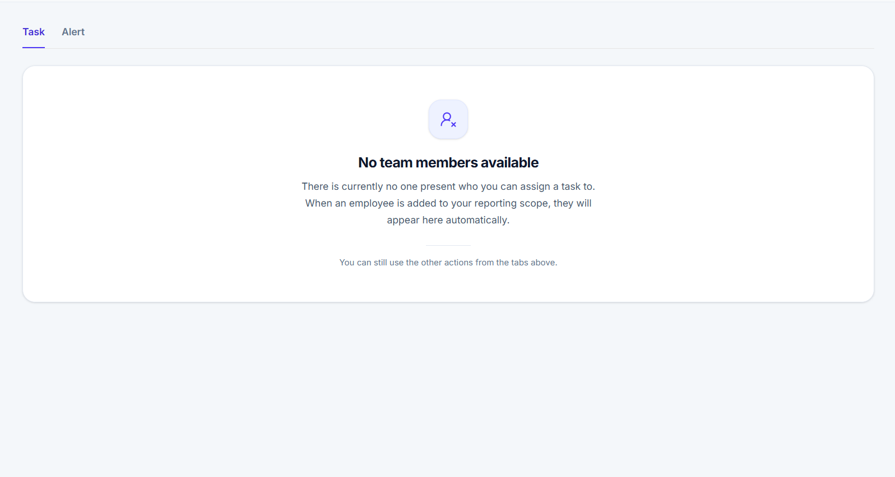

The other action tabs remain available. When a valid reportee is added to the employee's reporting structure, the Assign Task form appears automatically and the reportee becomes available in **Assign to**.

## 3. Where to click

1. Open **Daily Work Management**.
2. Open the left menu.
3. Click **Assign task** at the top of the menu.
4. The Actions screen opens with the **Task** tab selected.

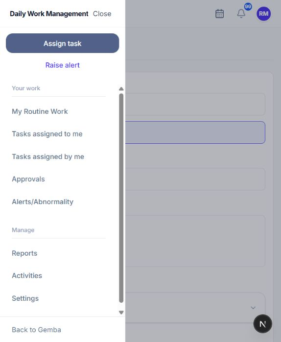

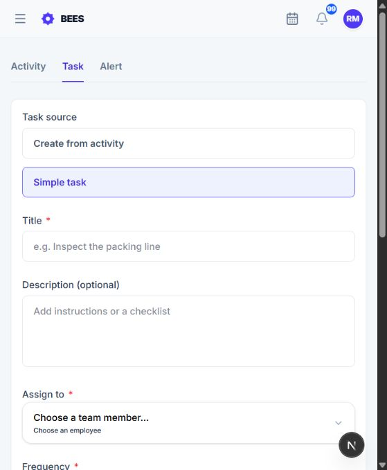

## 4. Choose the task source

### Simple task

Enter the task title and description yourself. You decide whether a completion document is required.

### Create from activity

Choose an active standard activity. DWMS fills the title, description, evidence requirement, and other available task details from that activity.

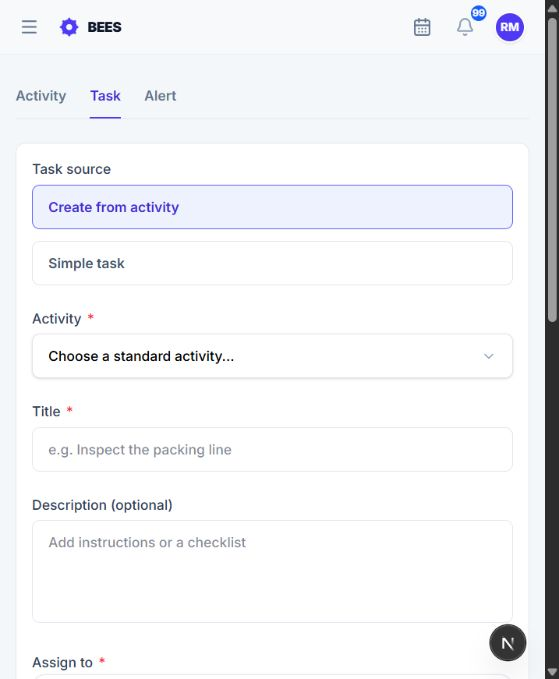

Activity mode adds an Activity field. The completion-document switch is inherited from the selected activity and cannot be changed here.

An activity describes standard work. Creating a task from it does not change the activity. The new task keeps a link to the activity so its instructions and relationships remain part of the work. Archived activities cannot be used.

## 5. Complete the form

- **Activity — required in activity mode:** The standard activity used for the task.
- **Title — required:** The task name shown in lists, notifications, and details.
- **Description — optional:** Instructions the owner reads before doing the work.
- **Assign to — required:** The one employee who owns and completes the task.
- **Frequency — required:** Once, Daily, Weekly, Monthly, Quarterly, or Yearly.
- **Due date — required for Once:** The working day by which a one-time task must be completed.
- **Priority — required:** Medium, High, or Critical urgency.
- **Approver — optional:** The person who reviews submitted completion. None allows direct completion when no other review rule applies.
- **Notify when overdue — optional:** Additional people who receive overdue alerts. Up to 10 unique employees can be selected.
- **Document required for completion — optional:** Prevents completion until the owner attaches evidence.
- **Document Name — required when a document is required:** Tells the owner which file is expected.

## 6. How employees are selected

Click **Assign to** and search by employee name or the information shown in the picker. Selecting a person makes them the task owner.

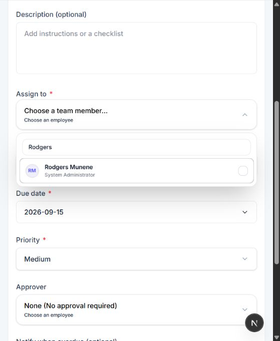

Each option shows the employee's name and designation. The employees in this list depend on the creator's access.

### How all reportees are found

1. DWMS finds employees whose reporting manager is the task assigner.
2. It finds employees reporting to those employees.
3. It continues through each lower level of the reporting structure.
4. Repeated employee IDs are removed.

If B reports to A and C reports to B, both B and C are reportees of A. Job title alone does not create this relationship.

After an owner is selected, DWMS loads the valid approvers and overdue-alert recipients for that owner. Changing the owner clears selections that are no longer valid.

## 7. Frequency and dates

Choose how often the work should happen.

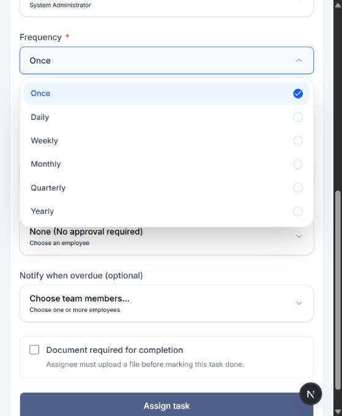

Once creates a one-time task. The other choices run on an automatic repeating schedule.

- **Once:** Shows the due-date calendar and creates one occurrence for the selected day.
- **Daily:** Creates a separate occurrence for each scheduled working day.
- **Weekly:** Creates a weekly occurrence.
- **Monthly:** Creates a monthly occurrence.
- **Quarterly:** Creates an occurrence for each quarter.
- **Yearly:** Creates a yearly occurrence.

Recurring work does not ask for a due date, start date, end date, or custom weekday.

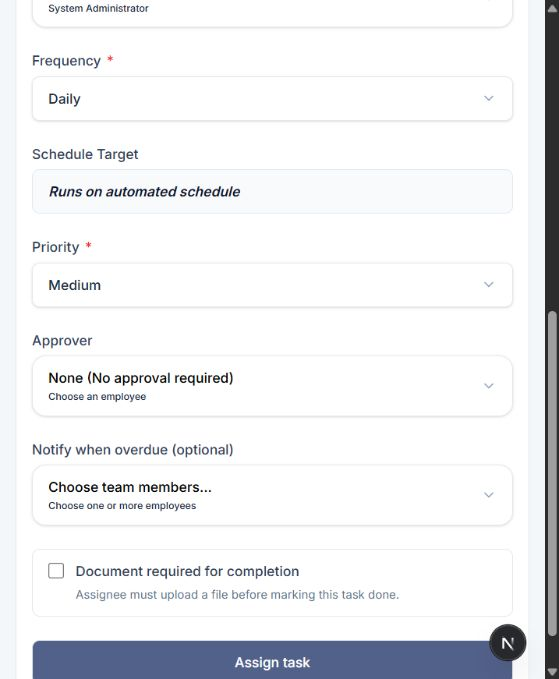

### One-time due date

The calendar uses the organization's date, working days, and recognized holidays. Past dates, non-working days, and holidays are disabled.

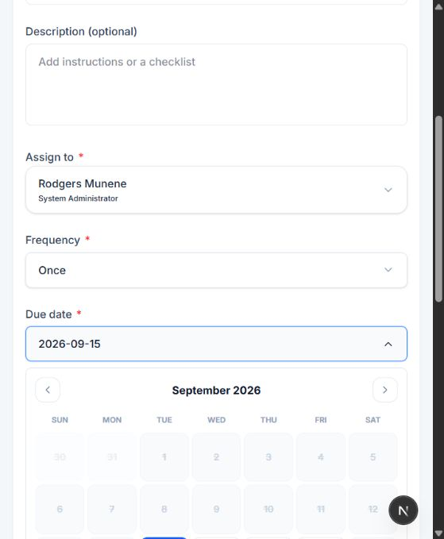

## 8. Priority

Click Priority to choose the urgency shown on the owner's task.

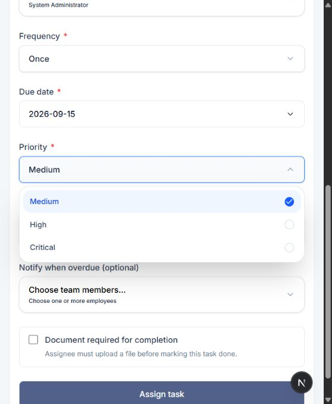

- **Medium:** Normal urgency and the default choice.
- **High:** Work requiring greater attention.
- **Critical:** The most urgent work.

Priority appears on the owner's task card and is also used by task delay and acknowledgement timing rules where configured.

## 9. Approval and overdue alerts

### Approver

The approver list is calculated for the selected owner using DWMS approver settings. The creator and owner are removed unless the rules specifically allow them. Selecting **None (No approval required)** means there is no named approver.

The approver list appears after an owner is selected. Search the list and select one employee, or keep None.

When an approver is selected, marking the task Done submits it as **Approval Pending**. The approver receives a notification and decides whether to approve or reject it.

### Notify when overdue

The selected employees receive the task-delay alert in addition to the people selected by escalation rules. They do not become task owners or approvers.

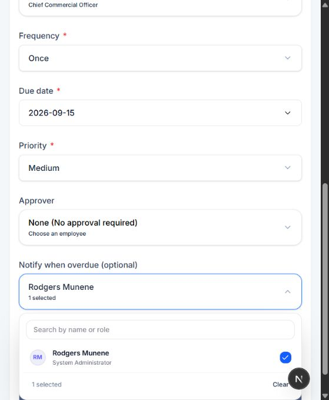

A selected employee will be included as an additional overdue-alert recipient.

## 10. Completion evidence

Turn on **Document required for completion** when the owner must prove the result with a file. Enter a clear document name such as “Signed inspection checklist” or “Completed audit report.”

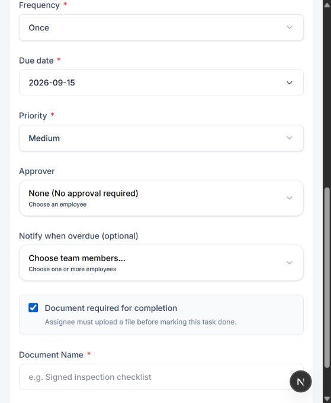

The owner cannot submit Done without an attachment when this switch is enabled.

In activity mode, the evidence rule and document name come from the activity. The switch is read-only because the standard activity controls it.

## 11. What happens after clicking Assign task

1. **Validation:** DWMS checks required fields, creator access, selected owner, date, priority, approver, recipient count, and evidence settings.
2. **Task saved:** The creator is stored as Assigned By and the selected employee as Owner.
3. **Occurrences created:** A one-time occurrence is created for its date. Recurring occurrences are generated according to the automatic schedule.
4. **Owner notified:** The owner receives a **New Task Assigned** notification that opens the **Assigned to me** view of Assigned Tasks.
5. **Creator redirected:** The creator is taken to the **Assigned by me** view, where acknowledgement and progress can be followed.

The owner can read the instructions, acknowledge the assignment, update progress, add comments, and submit completion. The assigner can follow acknowledgement and progress. A selected approver receives the work only after completion is submitted for review.

> Opening the form, selecting employees, and changing fields do not affect another employee. The task is created only after **Assign task** succeeds.

## 12. Restrictions and messages

- **No team members available:** The creator has no eligible reportees, so the complete Assign Task form is replaced by an informational message.
- **A date cannot be selected:** It is in the past, a non-working day, or a recognized holiday.
- **Document Name is required:** Enter the expected file name or turn off the document requirement.
- **Activity is unavailable:** Archived activities cannot create new tasks.
- **Assign task is saving:** Wait for the save to finish. The button is disabled during the request.

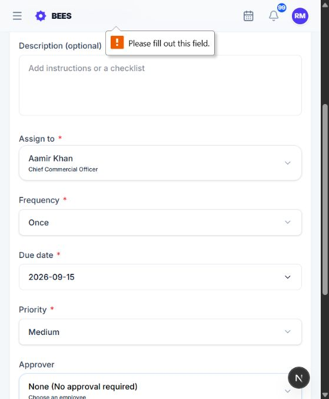

If a required field is empty, the form moves focus to it and asks for the missing value. The task is not created.
