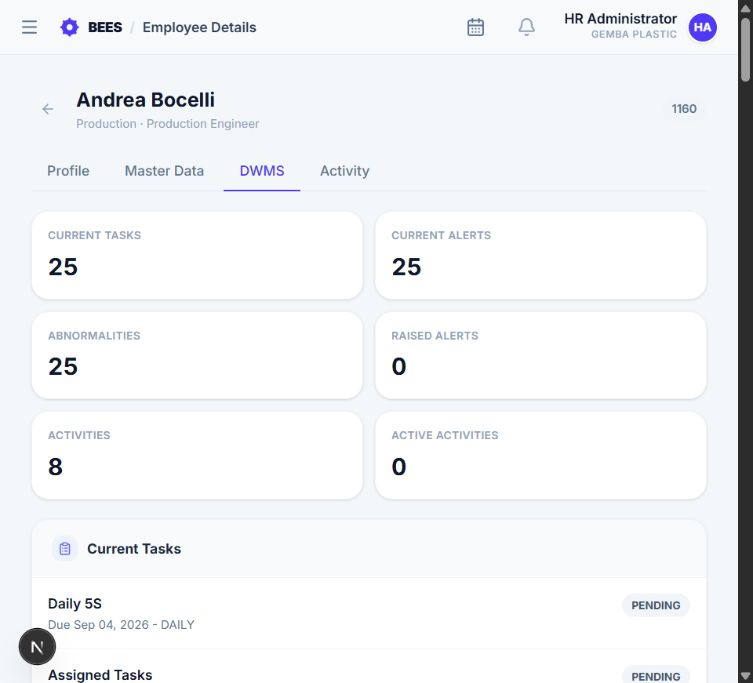
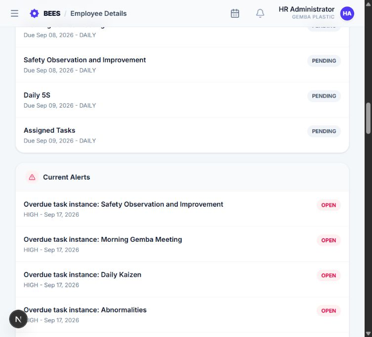
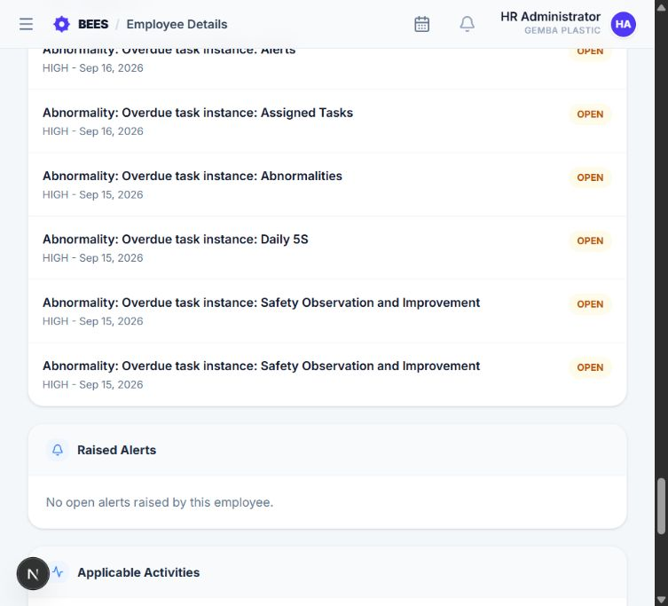
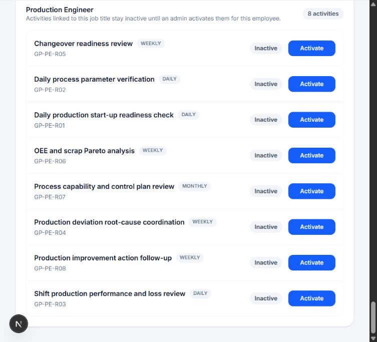

# Employee DWMS details

Employee DWMS details adds an operational DWMS panel to an employee's EMS profile. It brings together the employee's current work, alert responsibility, abnormalities, raised alerts, and activities applicable to their job title.

> Use this page when supporting one employee. It answers “What work and issues currently involve this person?” without searching several DWMS pages separately.

## 1. Open the panel

Open **EMS**, choose an employee, and view the employee detail page. The DWMS section is available only to authorized Management, Admin, Super Admin, and HR users.

The selected employee must belong to the current organization.

## 2. Read the summary

The summary counts current tasks, current alerts, abnormalities, raised alerts, applicable activities, and active activities. Counts describe the selected employee, not the viewer.

- **Current tasks:** Work the employee still needs to finish.
- **Current alerts:** Open problems for which the employee is responsible.
- **Abnormalities:** Open issues that have crossed an abnormality rule or were recorded as abnormalities.
- **Raised alerts:** Problems reported by the employee that remain open.
- **Applicable activities:** Standard work matching the employee's job role.
- **Active activities:** Applicable standard work currently enabled for the employee.

## 3. Current Tasks

Current Tasks lists the employee's open DWMS task occurrences with status, priority, and due information. Select a task to open its full DWMS detail when a link is available.

Completed and terminal historical work is not the focus of this panel; use Reports or the task workspaces for broader history.

## 4. Current Alerts

Current Alerts shows unresolved non-abnormality alerts for which the employee is responsible, either directly or through a linked task. Severity, status, and creation date help identify urgent items.

## 5. Abnormalities

Abnormalities shows open abnormality records involving the employee. These may have been created when a source alert exceeded its configured corrective-action window.

## 6. Raised Alerts

Raised Alerts shows unresolved non-abnormality alerts opened by the employee. The entry identifies the person, task owner, or General target involved.

## 7. Applicable Activities

Applicable Activities is based on the employee's job title and active Activity master records. Each item shows activity name, code, frequency, and assignment state.

- **Inactive:** The activity matches the job title but does not yet generate routine work for this employee.
- **Active:** The activity is enabled for the employee and can generate scheduled task occurrences.

If the employee has no job title, update Master Data first. If no activity matches the job title, create or update the responsible designation in Activities.

## 8. Activate or deactivate an activity

Authorized activity managers can select **Activate** or **Deactivate** beside an applicable activity.

Activating stores the employee-activity assignment and enables routine task generation according to the activity frequency and effective rules. Deactivating stops the assignment from producing future routine work; it does not erase previously created task history.

## 9. Effects across DWMS

- Active activity assignments feed My Routine Work and Tasks assigned to me.
- Current task and alert changes refresh the employee's operational picture.
- Completion and acknowledgement metrics appear in Reports.
- Alert responsibility contributes to the employee's open-alert count.

Access to this panel does not grant permission to alter task progress or approve work; those actions continue to use their normal DWMS ownership and approval rules.
