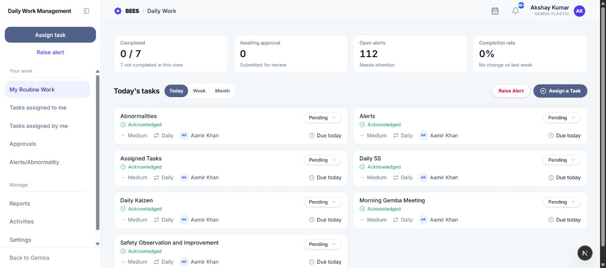

# My Routine Work

My Routine Work is the DWMS home page. It shows the signed-in employee's scheduled work, current alerts, and completion progress in the organization's time zone.

## 1. Open the page

Open **Daily Work Management** and select **My Routine Work**. The page is available to every signed-in DWMS user.

Use **Raise Alert** to report an abnormal situation or **Assign a Task** to create work for an eligible employee.

## 2. Read the summary

The summary cards describe the tasks in the selected Today, Week, or Month view.

- **Completed:** Completed applicable tasks compared with all applicable tasks. Not Applicable work is excluded.
- **Awaiting approval:** Tasks submitted as Done that still need an approver's decision.
- **Open alerts:** Alerts for which you are currently responsible.
- **Completion rate:** Completed applicable tasks as a percentage of the applicable total, together with the change from the previous comparable period.

## 3. Change the time view

- **Today:** Work scheduled for the organization's current date.
- **Week:** Work scheduled from the start of the current week up to, but not including, the next week.
- **Month:** Work scheduled from the start of the current month up to, but not including, the next month.

Tasks are grouped by scheduled date in the Week and Month views. Dates and deadlines use the organization's configured time zone rather than the device's local date.

## 4. Understand task cards

A task card can show the task title, description, priority, frequency, deadline, activity relationship, acknowledgement state, progress status, owner, assigner, and approval state.

Priorities are **Medium**, **High**, and **Critical**. An overdue task is highlighted even if its original priority was lower. Open a card to see the complete task record.

Recurring activity tasks are separate dated occurrences. Updating one occurrence does not complete future occurrences.

## 5. Acknowledge assigned work

New assigned work shows **Not Acknowledged**. Select **Acknowledge** to confirm that you have seen and accepted the task. DWMS records the acknowledgement time and informs the assigner.

Acknowledgement is separate from progress. Acknowledging a task does not start or complete it.

## 6. Update progress

Open the status control on an editable task and move it forward through the available states:

- **Pending:** Work has not started.
- **In Progress:** Work has started.
- **Less Than 50:** Some work is complete, but progress is below halfway.
- **Partly Done:** Work is partially complete.
- **Done:** Work is complete or submitted for approval.
- **Not Applicable:** The occurrence does not apply.

Progress cannot move backward. **Overdue** and **Approval Pending** are controlled by DWMS. Done, Not Applicable, and Approval Pending occurrences are locked against further owner updates.

If a task is already overdue, it can only be completed or submitted for approval.

## 7. Completion windows and prerequisites

Recurring work can be updated only in its scheduled completion window. Before that window, or after its due date, the status control explains why it is locked.

An activity may have a parent prerequisite. DWMS prevents progress on the dependent occurrence until the matching parent activity occurrence for the same scheduled date is Done. The task detail page shows the dependency chain and links to related occurrences.

## 8. Complete a task

Selecting **Done** opens the completion dialog.

1. Add an optional completion note.
2. Attach a completion file if useful.
3. If the task names a required document, attach that file before submitting.
4. Select **Mark Done**.

When no approval is required, the task becomes Done. When an approver applies, the task becomes **Approval Pending** and the approver is notified. A rejected submission returns to active work and the rejection comment appears in history.

## 9. Open task details

Select a task card to open its detail page. It includes:

- progress, priority, frequency, schedule, deadline, and overdue history;
- owner, assigner, department, and approver;
- required and submitted completion documents;
- activity dependency chain and related task occurrences;
- linked alerts;
- timestamped comments and status history.

Use **Add comment** to record context or a handoff. Comments are visible to users who can access the task.

## 10. Common restrictions

- A task outside its scheduled window cannot be updated yet.
- A dependent task stays locked until its prerequisite is complete.
- A required completion document cannot be omitted.
- A completed or approval-pending task cannot be changed by the owner.
- Past-due active work is managed as overdue by DWMS.

For a searchable history of all your work, open **Tasks assigned to me**.
