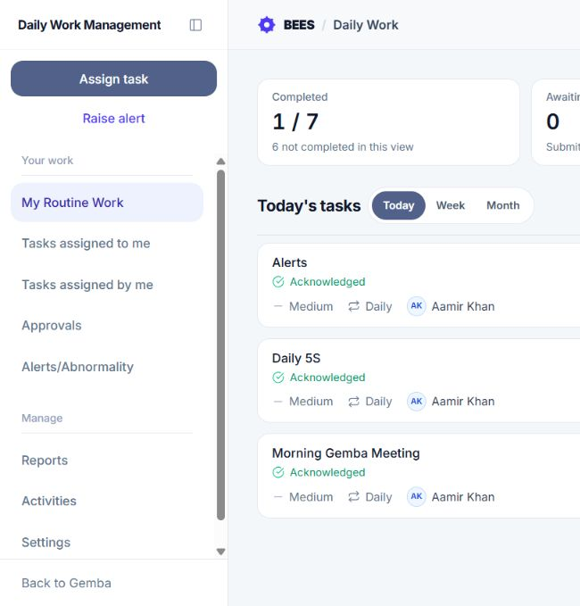
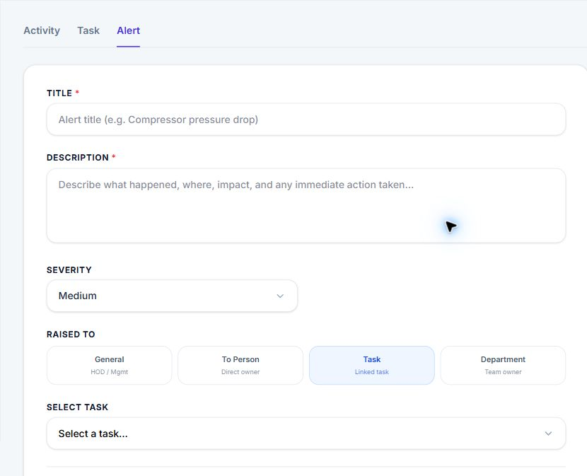
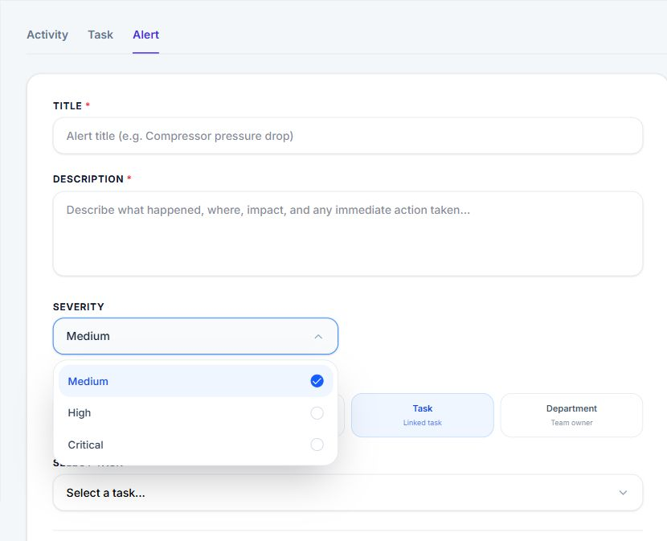
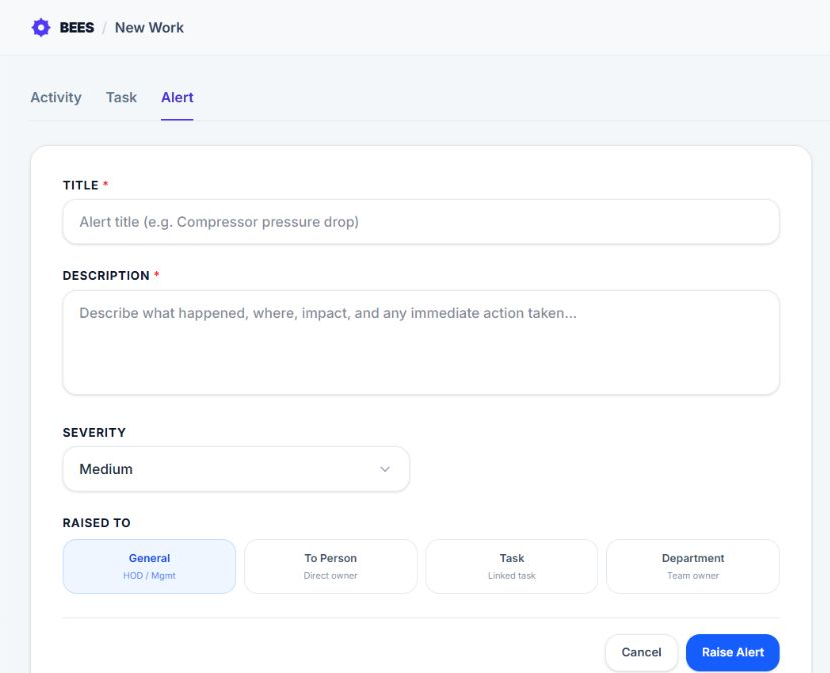
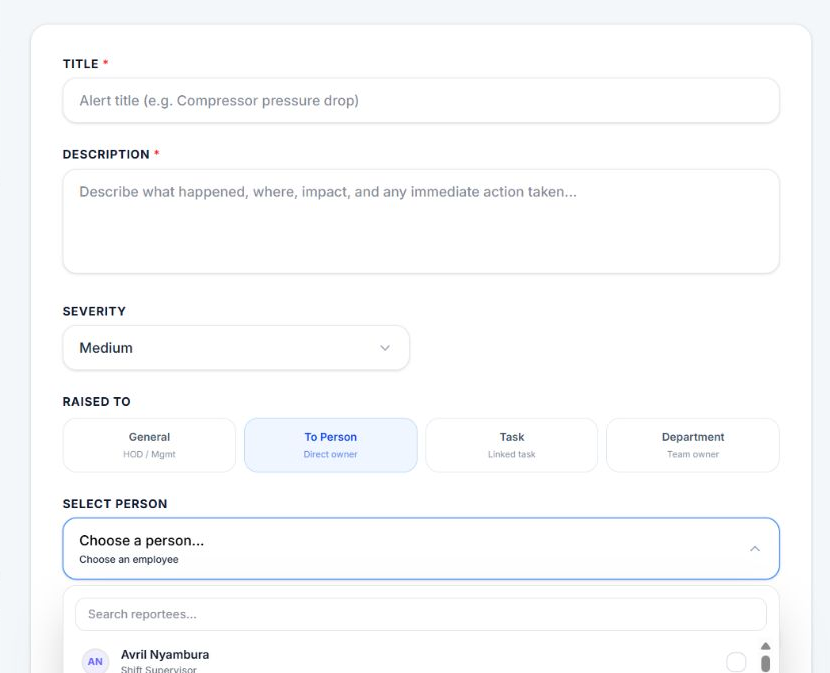
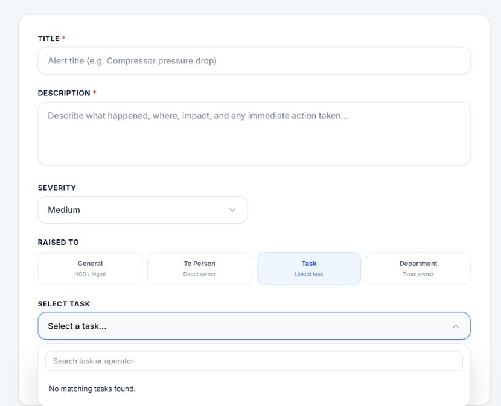
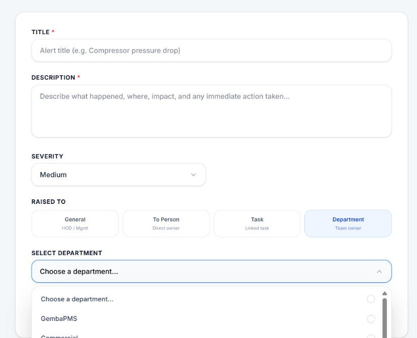
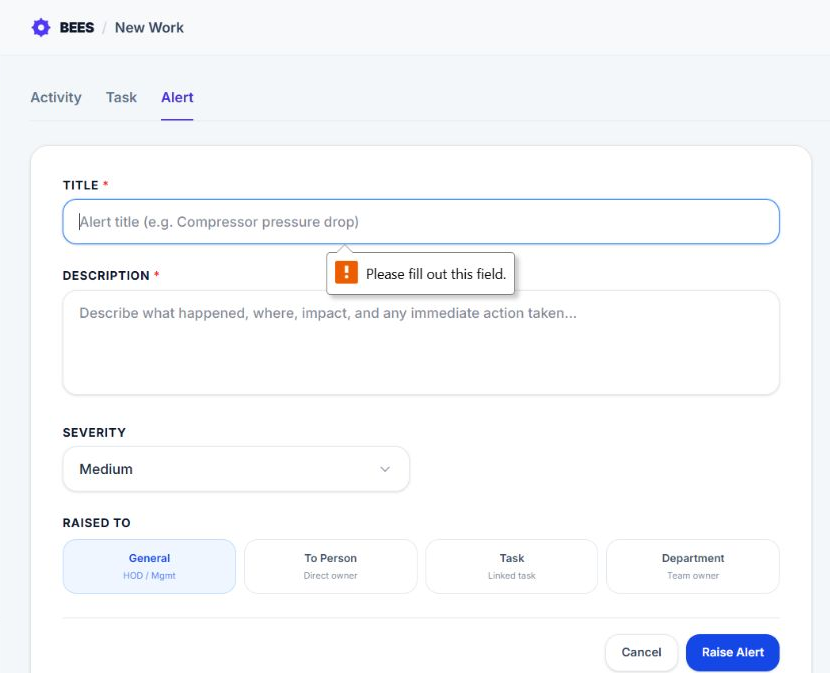

# Raise Alert

Raise Alert records an abnormal situation that needs attention. The alert can be directed to a person, linked to a recently completed task, assigned to a department, or raised generally by an HOD or Management user.

> **Quick start:** Describe what is wrong, choose how urgent it is, send it to the person or team best able to act, and select **Raise Alert**. An alert is for a problem that needs follow-up; it is not a replacement for an ordinary work instruction.

## 1. What Raise Alert does

The feature records what happened, its operational severity, who raised it, and the person, task, or department responsible for follow-up. Every manually raised alert starts as an **Abnormal Situation** with **Open** status.

- **Raised By:** The employee who creates the alert.
- **Raised To:** The target that should respond: General, Person, Task, or Department.
- **Severity:** Medium, High, or Critical operational impact.
- **Status:** The alert's progress from Open through corrective action and closure.

The alert appears in **Alerts / Abnormality**, where permitted employees can review its details and continue the corrective-action and closure workflow.

## 2. Who can use it

Every signed-in employee who can enter DWMS can open the Alert tab. The available targets depend on the employee's role, department, and reporting relationships.

- **General:** Enabled for HOD and Management users. It raises an organization-level alert without selecting a person, task, or department.
- **To Person:** Uses the same employee access rules as task assignment. Management-level roles can select employees across the organization. An HOD can select employees in their department, other HODs, and direct or indirect reportees. Other employees can select their direct and indirect reportees.
- **Task:** Shows eligible recent task occurrences owned by direct or indirect reportees.
- **Department:** Management-level roles can choose any department. Other employees, including HODs, are offered their own department.

An alert cannot be raised against the creator or against the creator's own task. DWMS checks target permission again when the alert is saved.

## 3. Where to click

1. Open **Daily Work Management**.
2. Open the left menu.
3. Click **Raise alert** near the top of the menu.
4. The Actions screen opens with the **Alert** tab selected.

You can also click **Raise Alert** above the task list on the My Routine Work screen. The Activity and Task tabs on the Actions screen let eligible users switch to other creation forms.

## 4. Complete the alert details

- **Title — required:** A short, specific name for the abnormal situation. It appears in the alert list, details, and notification.
- **Description — required:** What happened, where it happened, the impact, and any immediate action already taken.
- **Severity:** Medium, High, or Critical. Medium is selected initially.
- **Raised To:** General, To Person, Task, or Department. Task is selected initially.
- **Target — required except for General:** Select the person, task, or department shown for the chosen target type.

The guidance card beside the form changes when a field receives focus. It gives field-specific suggestions and an example without changing the alert.

## 5. Choose severity

Severity describes operational impact, not how urgently the creator personally wants a response.

- **Medium:** A localized issue with limited impact that still needs correction.
- **High:** A meaningful business, quality, delivery, or reliability impact needing quick attention.
- **Critical:** A safety issue, production stoppage, or major compliance or operational risk.

Low severity is not available for DWMS alerts. Choose the level that best reflects the observed effect and explain the evidence in the description.

## 6. Choose who receives the alert

Use this simple rule when choosing a target:

- **One known employee should act:** Choose To Person.
- **The problem was found while checking completed work:** Choose Task.
- **A team owns the area, but the exact person is not known:** Choose Department.
- **The issue affects the wider organization:** Choose General.

### General

Use **General** for an organization-level abnormal situation when there is no single task, person, or department target. The option is available only to HOD and Management users in the form. No additional target field is shown.

### To Person

Use **To Person** when one employee can directly respond. Open **Select Person**, search the available employees, and choose one person. Each option shows the employee's name and supporting employee information.

The picker is based on task-assignment access. The creator cannot raise an alert against themselves, even if their own name is returned in a management-level list.

### Task

Use **Task** when the abnormal situation was found while reviewing a known piece of work. Open **Select Task** and search by task title or owner. Each result identifies the task and the employee who owned it.

The list contains **Done** or **Not Applicable** task occurrences owned by the creator's direct or indirect reportees. Only occurrences completed or updated during the previous seven days are included. The creator's own tasks are not valid targets.

Linking a task gives the alert a direct connection to that occurrence and identifies the task owner as the person being alerted.

### Department

Use **Department** when responsibility is shared by a team or the exact resolver is not known. Select the department closest to the process, asset, or problem and include enough detail for the team to identify the right action owner.

Management-level users are offered all departments in the organization. Other employees can raise a department alert only in their own department. An employee without a department has no department target available.

## 7. Write a useful alert

A resolver should be able to start investigating without first asking what the alert means.

1. Name the equipment, process, area, document, or task in the title.
2. State what was observed and when and where it happened.
3. Quantify the impact where possible, such as minutes stopped, quantity affected, or variance found.
4. Record temporary containment or immediate action already taken.
5. Select the person, task, or department that owns the next action.

For example, use “Compressor pressure drop in Utility Area” instead of “Machine issue.” A useful description could state the observed pressure, time, production impact, and whether maintenance was informed.

## 8. What happens after clicking Raise Alert

1. **Validation:** DWMS checks the required text, allowed severity, target selection, and the creator's permission for that target.
2. **Alert saved:** The creator is stored as Raised By. The alert is stored as an Abnormal Situation with Open status and the selected severity.
3. **Target linked:** The selected person, task occurrence, or department is connected to the alert. A General alert has no specific target record.
4. **Notification sent when applicable:** A person target receives an **Alert Raised Against You** notification. For a task target, the task owner receives the same notification. It opens the new alert's details.
5. **Creator redirected:** The creator is taken to **Alerts / Abnormality**, where the new alert can be found and followed.

Department and General alerts do not send the direct “Alert Raised Against You” notification at creation because no individual target was selected. Their visibility is controlled by the alerts view and DWMS alert visibility settings.

> Changing fields or targets does not notify anyone. The alert is created only after **Raise Alert** succeeds.

## 9. What happens next

The alert details screen is used for the response workflow. Depending on access and responsibility, employees can review the participants and linked work, add comments, record corrective action, and move the alert toward closure.

Closure may be direct or may require a closure request and approval, depending on who is acting and the configured DWMS rules. Automatic delay alerts and abnormality escalation are documented separately in **Alerts / Abnormality**.

## 10. Restrictions and messages

- **Title or Description is empty:** The browser asks for the missing required value. No alert is created.
- **No people appear:** The creator may have no permitted reportees, or the target list may not have loaded.
- **No tasks appear:** Only recently completed or Not Applicable reportee task occurrences from the previous seven days are offered.
- **General is unavailable:** The current form enables General only for HOD and Management users.
- **No departments appear:** The employee may not be assigned to a department, or the target list may not have loaded.
- **A target was not selected:** Choose a person, task, or department for the selected target type.
- **You cannot target yourself or your own task:** Choose an eligible reportee, reportee task, department, or General where available.
- **Failed to load alert targets:** Refresh the form before choosing a person, task, or department.
- **Raise Alert is saving:** Wait for the request to finish. The button shows **Raising Alert...** and is disabled during submission.

Click **Cancel** to leave the form and return to **Alerts / Abnormality** without creating an alert.
