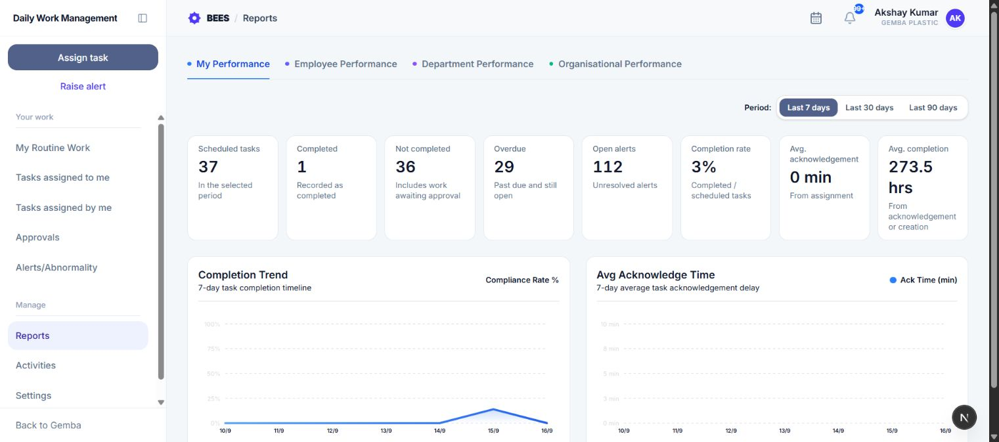
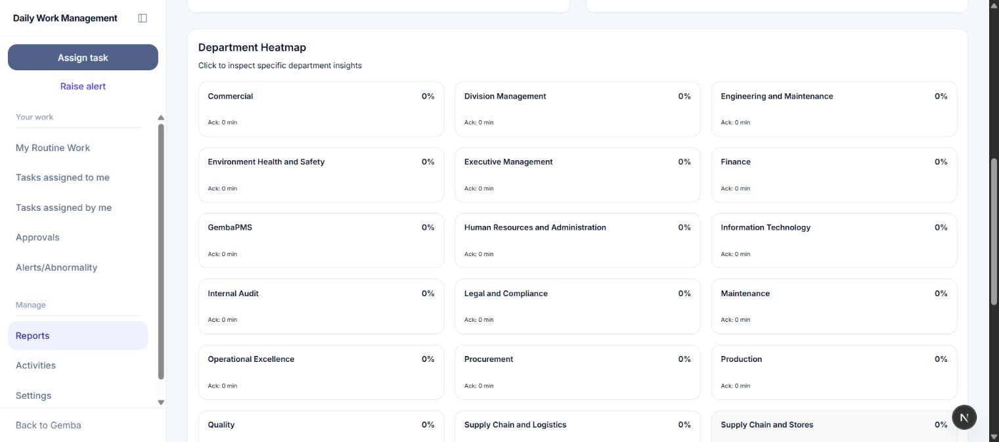

# Reports

Reports presents task completion, acknowledgement speed, completion speed, overdue work, and open alerts for the employee, team, department, or organization levels allowed by the user's role.

## 1. Open Reports

Select **Reports** in Daily Work Management. The initial tab is **My Performance**.

## 2. Available views

- **My Performance:** Available to every user and limited to the signed-in employee.
- **Employee Performance:** Available to HOD and Management users. It starts with the user's reportees and lets the viewer inspect an employee.
- **Department Performance:** Available to HOD and Management. HOD users see their department; Management can select a department.
- **Organisational Performance:** Available to Management and covers the entire organization.

## 3. Choose a period

Use the period buttons to switch the reporting window. The available ranges are 7, 30, 90, or 365 days. The same range is used for summary metrics and trend charts.

Dates are evaluated using the organization's configured time zone.

## 4. Understand the KPI cards

- **Scheduled tasks:** Task occurrences in the selected period.
- **Completed:** Occurrences recorded as Done.
- **Not completed:** Scheduled minus completed, including work awaiting approval.
- **Overdue:** Open occurrences past their due time.
- **Open alerts:** Unresolved alerts in the selected scope.
- **Completion rate:** Completed divided by scheduled tasks.
- **Avg. acknowledgement:** Average time from assignment to acknowledgement.
- **Avg. completion:** Average time from acknowledgement, or creation when not acknowledged, to completion.

An em dash means the metric is unavailable or has no valid denominator.

## 5. Trend charts

- **Completion Trend:** Daily compliance rate across the selected period.
- **Avg Acknowledge Time:** Daily average acknowledgement delay in minutes.

Use the chart points to inspect the value for a date. A gap can mean there was no applicable data for that day.

## 6. Employee Performance

The team-level view lists reportees with role, department, completion percentage, and average acknowledgement time. Select a reportee to inspect that employee's metrics and trends. Use **Inspect Employee** to search or return to **Show All Reportees**.

## 7. Department Performance

The department view shows its summary, trends, and an employee performance scoreboard. Management can switch departments from the selector. HOD users are directed to their own department.

The scoreboard shows each employee's task-completion percentage and acknowledgement speed for comparison within the selected period.

## 8. Organisational Performance

The organization view includes:

- a department heatmap using completion rates;
- average acknowledgement information per department;
- an organization employee scoreboard and ranking.

Select a department in the heatmap to open its Department Performance view. Heatmap colors summarize rate bands: at least 80%, 50-79%, and below 50%.

## 9. Interpreting results

- Approval-pending work counts as not completed until approved.
- Not Applicable work does not count as completed performance.
- Overdue history can remain relevant even after a task is later completed.
- A fast acknowledgement time measures response to assignment, not completion quality.
- Use the task and alert workspaces to investigate individual records behind a metric.
