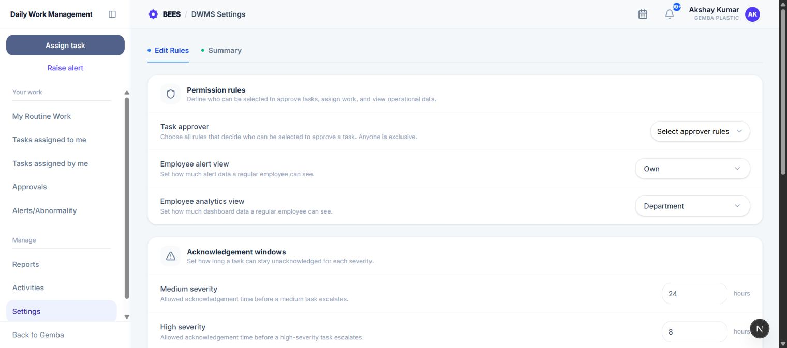
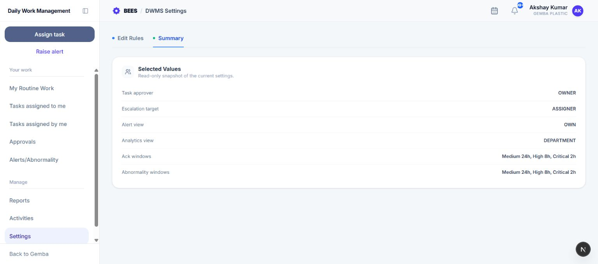

# Settings

Settings controls DWMS approval candidates, alert and analytics visibility, acknowledgement escalation, automatic abnormalities, and escalation recipients for the current organization.

> **Important:** Settings apply across the organization. If you are unsure, review the Summary tab and confirm the intended rule with the process owner before saving.

## 1. Who can use Settings

Management, Admin, Super Admin, and HR users can open and save DWMS Settings. Other roles do not see Settings in the DWMS menu and receive a restricted page if they open the route directly.

Changes affect future routing and automated processing across the organization, so review the Summary tab before and after saving.

## 2. Edit and Summary tabs

- **Edit Settings:** Change the current rules and select **Save changes**.
- **Summary:** Read a snapshot of the currently selected values without editing them.

Values are not active until the save request succeeds.

### What each group changes

- **Task approver rules:** Who appears when an assigner chooses an approver.
- **Employee alert view:** Which alerts a regular employee can browse.
- **Employee analytics view:** Which performance information a regular employee can access.
- **Acknowledgement windows:** How long an unacknowledged task waits before escalation.
- **Abnormality windows:** How long an open alert waits before an abnormality is created.
- **Escalation targets:** Who receives escalation notifications.

## 3. Task approver rules

Choose which people can appear in the Approver picker after an assignee is selected.

- **Management:** Management employees.
- **HOD:** Department heads.
- **Assignee Manager:** The assignee's immediate reporting manager.
- **Higher level Managers:** Managers above the direct manager in the reporting chain.
- **Anyone:** Any employee in the organization; this is an exclusive broad rule.
- **Custom Employee:** Up to three specifically selected employees.

The task owner remains part of the stored rule model, while the picker and server remove invalid self, creator, or duplicate choices as appropriate. Changing the assignee recalculates candidates.

## 4. Employee alert view

Set how much alert data a regular employee can see:

- **Own:** Personal, responsible, recipient, task-linked, or self-raised alerts.
- **Department:** Own visibility plus department and reportee-related alerts.
- **Organization:** All alerts in the current organization.

Management always receives organization-level alert visibility. HOD users receive at least department visibility.

## 5. Employee analytics view

Choose **Own**, **Department**, or **Organization** as the configured analytics scope for regular employees. The Reports interface also applies its role-specific tabs: every user gets My Performance, HOD and Management get employee and department views, and Management gets the organization view.

## 6. Acknowledgement windows

Enter the number of hours an unacknowledged task may remain before escalation for each priority:

- Medium;
- High;
- Critical.

Use zero only when escalation should be eligible immediately. Higher urgency normally uses a shorter window.

## 7. Abnormality windows

Enter the maximum hours an unresolved alert may remain without corrective action before DWMS creates a linked abnormality. Configure separate Medium, High, and Critical values. This time-based rule is separate from the three-overdue-occurrence rule for task instances.

The new abnormality retains a relationship to its source alert so both records can be traced from the alert detail page.

## 8. Escalation targets

Choose who can receive task escalation alerts:

- **Assigner:** The employee who assigned the task.
- **Managers:** Managers in the assignee's reporting chain.
- **Custom Employees:** Up to three selected employees.

These organization rules combine with any eligible **Notify when overdue** recipients selected on an individual task. Duplicate recipients are removed.

## 9. Save safely

1. Review approver choices and visibility scope.
2. Confirm acknowledgement and abnormality hours by severity.
3. Confirm at least one useful escalation target.
4. Open Summary and review the selected values.
5. Return to Edit Settings and select **Save changes**.

Custom employee selections are stored only while their corresponding Custom rule is enabled. All hour fields must be zero or greater, and each custom list accepts at most three unique employees.

## 10. Operational effects

Settings influence who can be selected when assigning a task, who receives automated delay alerts, which alerts users can browse, which reporting scopes are exposed, and when an unresolved alert becomes an abnormality. Existing task and alert history is retained when configuration changes.
