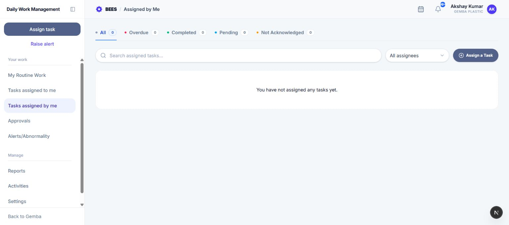

# Tasks assigned by me

Tasks assigned by me lets an assigner follow acknowledgement, progress, deadlines, completion, and evidence for work they created.

## 1. Open the workspace

In Daily Work Management, open the left menu and select **Tasks assigned by me**. After a new task is assigned successfully, DWMS also redirects the creator here.

## 2. Use the tabs

- **All:** Every task occurrence created by you.
- **Overdue:** Occurrences currently in Overdue status.
- **Completed:** Done occurrences.
- **Pending:** Acknowledged occurrences that are not Done or Overdue. This can include work awaiting approval.
- **Not Acknowledged:** Active work the owner has not acknowledged. Recurring items are grouped for a clearer list.

Each tab displays a count. Completed work is ordered from newest to oldest; active work is ordered by its relevant scheduled or due date.

## 3. Search and filter

Use **Search assigned tasks** to find a title, description, status, assignee, or assigner. Use **All assignees** to restrict the list to one task owner. Search and assignee filtering apply together.

## 4. Read a task card

A card shows the task title, description, priority, status, assignee, schedule or due date, and whether the owner acknowledged it. Completed items can show the completion note and a link to the submitted file. **Was overdue** means the task missed its due time before it was eventually completed.

Select a card to open the full task record, including approver, dependencies, linked alerts, comments, and status history.

## 5. Follow the lifecycle

1. **Assigned:** The owner receives a new-task notification.
2. **Acknowledged:** The acknowledgement time is recorded and the assigner is notified.
3. **In progress:** The owner advances the task through its allowed progress states.
4. **Approval pending:** If an approver applies, Done submits the work for review.
5. **Done or returned:** Approval completes the task; rejection returns it to active work with the reviewer comment.
6. **Overdue:** DWMS marks unfinished work overdue after its due time and creates configured delay alerts.

The assigner monitors this flow but does not change the owner's task progress from this page.

## 6. Assign more work

Select **Assign a Task** to open the Task form. The assignee list still follows your role and reporting access. See **Assign Task** in this guide for schedule, approver, evidence, and notification rules.

## 7. Common questions

- **Why is a task still Pending?** Pending includes acknowledged active work that has not completed or become overdue.
- **Why is approval-pending work under Pending?** The assigner page groups acknowledged non-completed, non-overdue work in Pending.
- **Why are several recurring items grouped?** The Not Acknowledged tab groups frequency-based occurrences to reduce repetition.
- **Where is the submitted file?** Open the card or task detail page; files appear only when the owner attached one.
