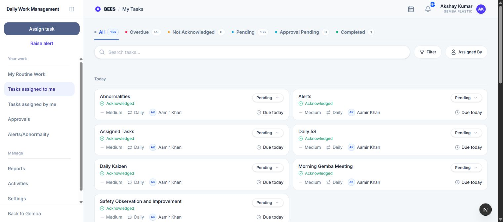

# Tasks assigned to me

Tasks assigned to me is the searchable workspace for every task occurrence you own, including current, overdue, approval-pending, and completed work.

## 1. Open the workspace

In Daily Work Management, open the left menu and select **Tasks assigned to me**. Every signed-in DWMS user can open their own list.

## 2. Use the status tabs

Each tab shows its item count.

- **All:** Every task occurrence available in the history.
- **Overdue:** Active occurrences past their due time.
- **Not Acknowledged:** Active work that you have not acknowledged. Repeating occurrences are grouped so the list remains useful.
- **Pending:** Acknowledged work that is not Done or Overdue.
- **Approval Pending:** Completion submitted to an approver.
- **Completed:** Done occurrences.

## 3. Search and filter

Search task titles and other displayed task information with **Search tasks**. Use **Filter** to limit the list to Daily, Weekly, or Monthly frequency, and **Assigned By** to show tasks from one assigner.

Filters work together. Clear them or return to All when an expected task is not visible.

## 4. Read and sort the list

The list groups work by the date relevant to the current tab. Current work uses its scheduled date, overdue work uses its due date, and completed work uses its completion date. Completed items are ordered with the most recent first; active items are ordered from earlier to later.

Each card identifies the task, priority, schedule, acknowledgement, and status. Open the card for instructions, ownership, documents, dependencies, alerts, comments, and full history.

## 5. Acknowledge and update work

Select **Acknowledge** on new work. Then use the status control to move forward through Pending, In Progress, Less Than 50, Partly Done, Done, or Not Applicable as applicable.

DWMS does not allow backward progress. Overdue and Approval Pending are system-managed states. A recurring task can be updated only inside its scheduled window, and a dependent activity cannot progress until its prerequisite occurrence is Done.

## 6. Submit completion

When you select Done:

1. Add an optional completion note.
2. Attach evidence if needed.
3. Attach the named document when the task requires one.
4. Submit the completion.

Without an approver, the occurrence becomes Done immediately. With an approver, it becomes Approval Pending. If rejected, it returns to active work and the rejection explanation is retained in task history.

## 7. Task details and collaboration

The detail page shows Task Information, dependencies, linked alerts, History, and Comments. Use it to confirm the exact scheduled date and due time, review who assigned and approves the work, open attached evidence, follow status events, and leave a comment.

If an alert is linked to the occurrence, open it from the task details to follow the corrective-action workflow.

## 8. Troubleshooting

- **Cannot change status:** Check the schedule window, prerequisite chain, and whether the task is already terminal or awaiting approval.
- **Cannot mark Done:** Attach the required completion document.
- **Task is missing:** Clear filters and search, then check another status tab.
- **Task was rejected:** Open its history for the rejection comment and resubmit after correction.
