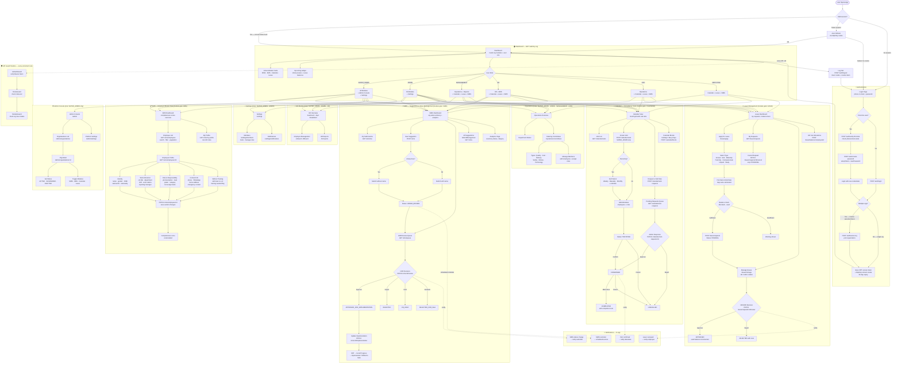

# Gemba EMS — Application Flow Diagram

```mermaid
flowchart TD
    %% ─────────────────────────────────────────────
    %%  ENTRY
    %% ─────────────────────────────────────────────
    START([User Opens App]) --> SESSION{Valid session?}
    SESSION -->|Yes — access token fresh| DASH
    SESSION -->|Token expired| REFRESH[Auto Refresh\nvia httpOnly cookie]
    REFRESH -->|OK| DASH
    REFRESH -->|Failed / no cookie| LOGIN
    SESSION -->|No session| LOGIN

    %% ─────────────────────────────────────────────
    %%  AUTH
    %% ─────────────────────────────────────────────
    subgraph AUTH ["🔐 Authentication"]
        direction TB
        LOGIN[Login Page\nphone or email + password]

        LOGIN --> FIRST{First-time user?}
        FIRST -->|Yes| FT_VERIFY[POST /auth/verify-first-time\ncheck phone/email exists]
        FT_VERIFY --> FT_PASS[POST /auth/create-password\nsetupToken + newPassword]
        FT_PASS --> FT_LOGIN[Login with new credentials]
        FT_LOGIN --> MULTI

        FIRST -->|No| DO_LOGIN[POST /auth/login]
        DO_LOGIN --> MULTI{Multiple orgs?}

        MULTI -->|Yes — returns selectionToken| SEL_ORG[POST /auth/select-org\npick organization]
        SEL_ORG --> ISSUE_TOKEN

        MULTI -->|No — single org| ISSUE_TOKEN[Issue JWT access token\n+ httpOnly refresh cookie\n30-day expiry]
    end

    ISSUE_TOKEN --> DASH

    %% ─────────────────────────────────────────────
    %%  DASHBOARD  
    %% ─────────────────────────────────────────────
    subgraph DASHBOARD ["🏠 Dashboard — GET /auth/my-org"]
        direction TB
        DASH[Dashboard\nloads org modules + user role]

        DASH --> MOD_CARDS[Active Module Cards\nSIMS · EMS · Calendar · Leave]
        DASH --> UPCOMING[Upcoming widget\nVisits preview + Leave balances]

        DASH --> ROLE{User Role}
        ROLE -->|SUPER_ADMIN| ACCESS_SA[All Modules\n+ Admin Console\n+ Settings]
        ROLE -->|ADMIN| ACCESS_A[All Modules\n+ Settings]
        ROLE -->|MANAGEMENT| ACCESS_M[Operations + Reports\n+ Calendar + Leave + SIMS]
        ROLE -->|HR| ACCESS_HR[HR + EMS\n+ Calendar + Leave + SIMS]
        ROLE -->|HOD| ACCESS_HOD[Operations\n+ Calendar + Leave + SIMS]
        ROLE -->|EMPLOYEE| ACCESS_EMP[Calendar + Leave + SIMS]
    end

    %% ─────────────────────────────────────────────
    %%  SIMS
    %% ─────────────────────────────────────────────
    subgraph SIMS ["💡 SIMS — Suggestions & Ideas Management  [module gate: SIMS]"]
        direction TB
        SIMS_HOME[SIMS Dashboard\norg-wide summary + analytics]

        SIMS_HOME --> SIMS_MY[My Submissions\nGET /sims/me]
        SIMS_HOME --> SIMS_NEW[New Suggestion\nPOST /sims]
        SIMS_HOME --> SIMS_QUEUE[HOD Review Queue\nGET /sims/queue]
        SIMS_HOME --> SIMS_ALL[All Suggestions\nAdmin/Management\nGET /sims]
        SIMS_HOME --> SIMS_ANA[Analytics Page\ncounts by status, category]

        SIMS_NEW --> ANON{Anonymous?}
        ANON -->|Yes| SUBMIT_A[Submit without name]
        ANON -->|No| SUBMIT_N[Submit with name]
        SUBMIT_A & SUBMIT_N --> PENDING_S[Status: UNDER_REVIEW]

        PENDING_S --> SIMS_QUEUE
        SIMS_QUEUE --> HOD_DEC{HOD Decision\nPATCH /sims/:id/review}
        HOD_DEC -->|Approve| S_APPROVED[APPROVED_FOR_IMPLEMENTATION]
        HOD_DEC -->|Reject| S_REJECTED[REJECTED]
        HOD_DEC -->|Hold| S_HOLD[ON_HOLD]
        HOD_DEC -->|Escalate| S_SGA[SELECTED_FOR_SGA]

        S_APPROVED --> IMPL[Update Implementation\nPATCH /sims/:id/implementation]
        IMPL --> IMPL_STATUS[WIP → Good Progress\n→ Implemented / Shifted to SGA]
    end

    %% ─────────────────────────────────────────────
    %%  EMS
    %% ─────────────────────────────────────────────
    subgraph EMS ["📋 EMS — Employee Master Data  [module gate: EMS]"]
        direction TB
        EMS_DASH[EMS Dashboard\ncompleteness scores overview]

        EMS_DASH --> EMS_LIST[Employee List\nGET /ems/employees\nsearch · filter · pagination]
        EMS_DASH --> EMS_MY[My Profile\nGET /ems/my-profile\nnon-HR roles]

        EMS_LIST --> EMS_PROF[Employee Profile\nGET /ems/employees/:id]

        EMS_PROF --> EMS_ID[Identity\nname · gender · DOB\nnational ID · nationality]
        EMS_PROF --> EMS_WORK[Work Allocation\njob title · department\nshift · work station\nreporting manager]
        EMS_PROF --> EMS_ROLE_SEC[Role & Responsibility\njob description · level\ngrade · category\ncan assign tasks]
        EMS_PROF --> EMS_CONTACT[Contact Info\nphone · WhatsApp\nhome address\nemergency contact]
        EMS_PROF --> EMS_SKILLS[Skills & Training\nskill level L1–L4\ntraining needed flag]

        EMS_ID & EMS_WORK & EMS_ROLE_SEC & EMS_CONTACT & EMS_SKILLS --> EMS_SAVE[PATCH /ems/employees/:id\nsave section changes]
        EMS_SAVE --> EMS_SCORE[Completeness score\nrecalculated]
    end

    %% ─────────────────────────────────────────────
    %%  CALENDAR
    %% ─────────────────────────────────────────────
    subgraph CAL ["📅 Calendar — Consultancy Visits  [module gate: CALENDAR]"]
        direction TB
        CAL_VIEW[Calendar View\nmonth grid with visit dots]

        CAL_VIEW --> CAL_VISITS[Visit List\nGET /calendar/visits]
        CAL_VIEW --> CAL_CREATE[Create Visit\nPOST /calendar/visits\nSUPER_ADMIN only]
        CAL_VIEW --> CAL_REQUEST[Request a Visit Date\nPOST /calendar/visit-requests]
        CAL_VIEW --> CAL_BLOCKS[Calendar Blocks\nHolidays / Busy Days\nPOST /calendar/blocks]

        CAL_CREATE --> CAL_RECUR{Recurring?}
        CAL_RECUR -->|Yes| CAL_RECUR_SET[Set Pattern\nWeekly · Biweekly · Monthly\n+ end date]
        CAL_RECUR -->|No| CAL_ATTENDEES
        CAL_RECUR_SET --> CAL_ATTENDEES[Add Attendees\nemployees + roles]
        CAL_ATTENDEES --> CAL_TENT[Status: TENTATIVE]

        CAL_TENT -->|Confirm| CAL_CONF[CONFIRMED]
        CAL_CONF -->|Mark done| CAL_COMP[COMPLETED\nwith completion note]
        CAL_CONF -->|Cancel| CAL_CANC[CANCELLED]
        CAL_TENT -->|Cancel| CAL_CANC

        CAL_REQUEST --> CAL_REQ_Q[Pending Requests Queue\nGET /calendar/visit-requests]
        CAL_REQ_Q --> CAL_REQ_DEC{Admin Response\nPATCH /calendar/visit-requests/:id}
        CAL_REQ_DEC -->|Approve| CAL_CONF
        CAL_REQ_DEC -->|Reject| CAL_CANC
    end

    %% ─────────────────────────────────────────────
    %%  LEAVE
    %% ─────────────────────────────────────────────
    subgraph LEAVE ["🌴 Leave Management  [module gate: LEAVE]"]
        direction TB
        LEAVE_DASH[Leave Dashboard\nmy requests + balance bars]

        LEAVE_DASH --> LEAVE_APPLY[Apply for Leave\n/leave/apply]
        LEAVE_DASH --> LEAVE_LIST[My Requests\nGET /leave/requests]
        LEAVE_DASH --> LEAVE_MANAGE[Manage Queue\n/leave/manage\nHR / HOD / Admin]
        LEAVE_DASH --> LEAVE_BALANCE[HR: Set Allocations\nPOST /leave/balance/:employeeId]

        LEAVE_APPLY --> L_FORM[Select Type\nAnnual · Sick · Maternity\nPaternity · Compassionate\nUnpaid · Study]
        L_FORM --> L_DATES[Pick Start & End Date\ndays auto-calculated]
        L_DATES --> L_CHECK{Balance check\nallocated − used}
        L_CHECK -->|Sufficient| L_SUBMIT[POST /leave/requests\nStatus: PENDING]
        L_CHECK -->|Insufficient| L_WARN[Warning shown]

        L_SUBMIT --> LEAVE_MANAGE
        LEAVE_MANAGE --> L_REVIEW{HR/HOD Decision\nPATCH /leave/requests/:id/review}
        L_REVIEW -->|Approve| L_APPROVED[APPROVED\nused balance incremented]
        L_REVIEW -->|Reject| L_REJECTED[REJECTED with note]

        LEAVE_LIST --> L_CANCEL[Cancel Request\nPATCH /leave/requests/:id/cancel\nonly if PENDING]
    end

    %% ─────────────────────────────────────────────
    %%  HR
    %% ─────────────────────────────────────────────
    subgraph HR ["🏥 HR Module  [roles: SUPER_ADMIN · ADMIN · HR]"]
        direction TB
        HR_HOME[HR Overview\nheadcount · dept breakdown]
        HR_HOME --> HR_EMP[Employee Management\nonboard / offboard]
        HR_HOME --> HR_REPORTS[HR Reports\n/hr/reports]
    end

    %% ─────────────────────────────────────────────
    %%  OPERATIONS
    %% ─────────────────────────────────────────────
    subgraph OPS ["🏢 Operations  [roles: SUPER_ADMIN · ADMIN · MANAGEMENT · HOD]"]
        direction TB
        OPS_HOME[Operations Overview]
        OPS_HOME --> OPS_DEPT[Department Roster]
        OPS_HOME --> OPS_COMM[Steering Committees\n/operations/committees]
        OPS_COMM --> OPS_COMM_TYPE[Types: Quality · Cost · Delivery\nSafety · Morale · Technology]
        OPS_COMM --> OPS_MEMBERS[Manage Members\nadd employees + assign roles]
    end

    %% ─────────────────────────────────────────────
    %%  ADMIN CONSOLE
    %% ─────────────────────────────────────────────
    subgraph ADMIN ["⚙️ Admin Console  [role: SUPER_ADMIN only]"]
        direction TB
        ADM_HOME[Admin Console\n/admin]
        ADM_HOME --> ADM_ORGS[Organizations List\n/admin/organizations]
        ADM_ORGS --> ADM_ORG_D[Org Detail\n/admin/organizations/:id]
        ADM_ORG_D --> ADM_STATUS[Set Status\nACTIVE · SUSPENDED · INACTIVE]
        ADM_ORG_D --> ADM_MODS[Toggle Modules\nSIMS · EMS · Calendar · Leave]
        ADM_HOME --> ADM_SETTINGS[Platform Settings\n/admin/settings]
    end

    %% ─────────────────────────────────────────────
    %%  SETTINGS
    %% ─────────────────────────────────────────────
    subgraph SETTINGS ["🔧 Settings  [roles: SUPER_ADMIN · ADMIN]"]
        direction TB
        SET_HOME[Settings\n/settings]
        SET_HOME --> SET_MEMBERS[Members\n/settings/members\ninvite · manage roles]
        SET_HOME --> SET_NOTIF[Notifications\n/settings/notifications]
    end

    %% ─────────────────────────────────────────────
    %%  API GUARD PIPELINE
    %% ─────────────────────────────────────────────
    subgraph GUARDS ["🛡️ API Guard Pipeline — every protected route"]
        direction LR
        G1[JwtAuthGuard\nverify Bearer token] --> G2[RolesGuard\ncheck roleLevel] --> G3[ModuleGuard\ncheck org has module]
    end

    %% ─────────────────────────────────────────────
    %%  NOTIFICATIONS
    %% ─────────────────────────────────────────────
    subgraph NOTIF ["🔔 Notifications — in-app"]
        direction LR
        N1[SIMS status change\n→ notify submitter]
        N2[Leave reviewed\n→ notify employee]
        N3[Visit confirmed\n→ notify attendees]
        N4[SIMS reminder\n→ scheduled service]
    end

    %% ─────────────────────────────────────────────
    %%  LOGOUT
    %% ─────────────────────────────────────────────
    DASH --> LOGOUT[Log Out\nPOST /auth/logout\nclear cookie + revoke token]
    LOGOUT --> LOGIN

    %% ─────────────────────────────────────────────
    %%  NAVIGATION CONNECTIONS
    %% ─────────────────────────────────────────────
    ACCESS_SA --> SIMS_HOME & EMS_DASH & CAL_VIEW & LEAVE_DASH & HR_HOME & OPS_HOME & ADM_HOME & SET_HOME
    ACCESS_A  --> SIMS_HOME & EMS_DASH & CAL_VIEW & LEAVE_DASH & HR_HOME & OPS_HOME & SET_HOME
    ACCESS_M  --> SIMS_HOME & CAL_VIEW & LEAVE_DASH & OPS_HOME
    ACCESS_HR --> SIMS_HOME & EMS_DASH & CAL_VIEW & LEAVE_DASH & HR_HOME
    ACCESS_HOD --> SIMS_HOME & CAL_VIEW & LEAVE_DASH & OPS_HOME
    ACCESS_EMP --> SIMS_HOME & CAL_VIEW & LEAVE_DASH

    %% guard + notification side-effects
    DASH -.->|every API call| G1
    HOD_DEC -.->|notify| N1
    L_REVIEW -.->|notify| N2
    CAL_CONF -.->|notify| N3
    PENDING_S -.->|scheduled reminder| N4
```
