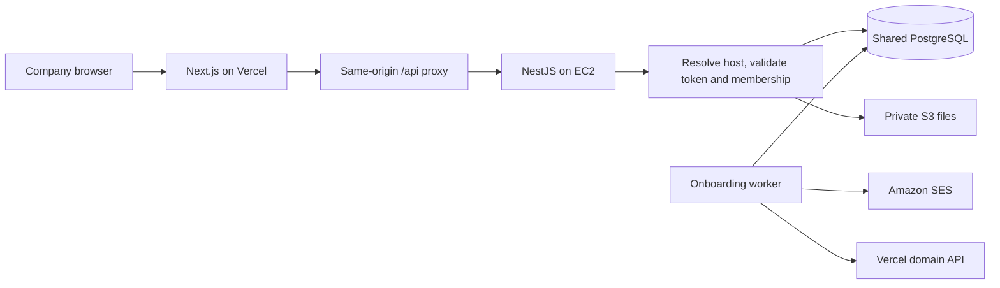
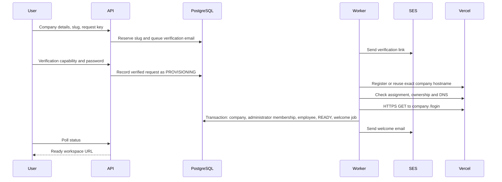

# Company onboarding and multi-tenancy

Last reviewed: **2026-09-23**. Scope: the implemented staging architecture and
operator-reported acceptance. This is not production approval or a fresh audit of
every endpoint and external setting.

## Guide

- [Operations and troubleshooting](operations.md): configuration, deployment,
  acceptance, incident diagnosis, and recovery.
- [Security risks](security.md): open risks that must be fixed before public
  signup, exposed endpoints, and the order to fix them in.
- [Scaling roadmap](scaling.md): remaining production gates, capacity triggers,
  domain strategy, workers, data, storage, and ownership.
- [File inventory](file-inventory.md): historical change set and file responsibilities.
- [Staging rollout](../staging/README.md): database/runtime-role/private-storage procedures.
- [Onboarding module contract](../../apps/api/src/onboarding/README.md): exact state,
  verification, retry, and domain registration behavior.

## What this architecture is called

Gemba uses **subdomain-based multi-tenancy with verified self-service onboarding
and automated domain provisioning**. A tenant is a company. Companies share the
Next.js frontend, NestJS API, PostgreSQL database, and storage infrastructure.
Provisioning does not create a separate server, deployment, or database per company.

The earlier shared-domain workflow selected a company through authentication or
company selection. It already had organization concepts; the new work did not
invent company membership. A shared-domain system can also be secure. The change
makes the hostname an explicit company identity and strengthens the surrounding
request, session, and ownership checks.

| Concern | Earlier shared domain | Current company workspaces |
| --- | --- | --- |
| Entry point | Shared address, company selected in the application | Direct company hostname |
| Context | Mainly login/session selection | Hostname resolved before company authentication |
| Browser sessions | Shared browser origin | Host-only refresh cookies and separate origins |
| Simultaneous companies | Requires managing selected-company state | Independent company sessions can coexist |
| Setup | Company creation without automatic host readiness | Verified signup, domain registration, HTTPS check, atomic company creation |
| Authorization | Company filtering still required | Host/token match, current membership, roles, company filtering and file checks |

## Current service responsibilities

| Service | Recorded staging responsibility |
| --- | --- |
| GoDaddy | Domain registrar; parent nameserver changes belong here |
| Hostinger DNS | Authoritative DNS for `gembapms.com`; includes wildcard company CNAME |
| Hostinger hosting/CDN | Main website at `gembapms.com` and `www.gembapms.com` |
| Vercel project `ems-web` | Central signup and company frontends, currently assigned to staging |
| Docker on EC2 | NestJS API and in-process background worker |
| PostgreSQL | Shared company records, onboarding reservations, outbox and job state |
| Amazon SES, `eu-north-1` | Verification and welcome email |
| Private Amazon S3 bucket | New company uploads with authorized retrieval |

Central signup is `https://bees.gembapms.com/signup`. A company slug such as
`test-bees` produces `https://test-bees.bees.gembapms.com/login`.
Known earlier companies include `gemba-plastic` and `kbcl`.

These are deployment facts recorded during setup, not immutable product defaults.
Confirm current account/project ownership and DNS before infrastructure changes.
Provider consoles and secret stores contain configuration that Git cannot verify.

## Request and security boundaries



1. Browser API calls use `/api/*` on the current workspace origin.
2. The server proxy validates host, origin and permitted paths, then supplies the
   private proxy credential and company hostname. Caller-supplied tenant context
   must not override this trusted context.
3. The API authenticates the proxy and resolves the hostname slug to an active
   organization. Unknown/suspended companies cannot become valid tenants just
   because wildcard DNS resolves their hostname.
4. Authenticated tenant routes require an access token for that same organization,
   current membership, current role, and active company status.
5. Business services scope records/relationships to the company. Managed file
   references and downloads require company ownership.

Refresh cookies are HttpOnly, secure in deployed environments, and host-only.
Access tokens are held in browser memory. Session restoration, tab coordination,
and logout operate within the company origin. Sibling subdomains are different
origins but can still be the same browser *site*; origin checks remain necessary.

New uploads use private objects and company-owned metadata. Transaction-local
PostgreSQL context supports forced RLS on `FileAsset`. **Business-table RLS is
not complete**: business isolation still depends on guards and service filters.
The legacy `/auth/*` routes do not check the proxy credential yet; see
[security risks](security.md).
Private new uploads do not automatically migrate old public URLs.

## Signup lifecycle



- Slugs are normalized, validated and reserved uniquely; reviewed backfill covers
  older organizations. The later required-slug SQL is a separate rollout decision.
- Signup request keys make repeated submissions idempotent. Email ownership is
  established before storing a new user's password hash or creating a company.
- Verification links expire after 30 minutes. Existing users must prove possession
  of their current account password; matching an email alone never attaches them.
- Domain API calls occur outside the final database transaction. Failed checks
  leave the request pending/retryable rather than creating incomplete company rows.
- A registered domain can remain after a later provisioning failure. The reserved
  slug and subsequent retries reuse it; automatic orphan cleanup is not implemented.
- Email delivery is at least once. A crash after SES accepts a message but before
  the database records success can result in duplicate email.

The state flow is `PENDING_VERIFICATION → PROVISIONING → READY`, with `EXPIRED`
for unverified expiry and `FAILED` for permanent conflicts or exhausted retries.
The worker ticks every ten seconds. Provisioning has five attempts, with gaps of
one, two, four and eight minutes before attempts two through five. API/probe calls
have eight-second timeouts; work and scheduling add to the roughly 15-minute retry
window. There is no guaranteed completion SLA. A normal signup may finish in
seconds to a few minutes; DNS/certificate/provider delays extend that time.

## Domain decision: retain Hostinger DNS

**Accepted staging choice:** wildcard DNS plus individual Vercel project domains.

```text
Hostinger DNS:
  bees    CNAME 7945812a2910defc.vercel-dns-017.com.
  *.bees  CNAME 7945812a2910defc.vercel-dns-017.com.

On each verified signup:
  register <slug>.bees.gembapms.com on ems-web / staging
  wait for correct assignment, DNS and HTTPS readiness
```

The project-specific CNAME target above was verified during setup. Use the target
shown by Vercel if the project changes. Exact DNS records take precedence over the
wildcard; audit old per-company records if a single company routes incorrectly.

DNS routes the hostname to Vercel; project registration binds the exact hostname
to the correct deployment. Vercel manages certificates for those domains. A
wildcard DNS record is not itself a wildcard TLS certificate or a Vercel wildcard
project binding. [Vercel domain management](https://vercel.com/docs/platforms/multi-tenant-platforms/configuring-domains)

| Approach | Benefits | Tradeoffs |
| --- | --- | --- |
| Current external DNS + exact domains through API | Preserves website/email/CDN arrangement; no manual per-company DNS work | API token, rate limits, domain quota and per-domain readiness become onboarding dependencies |
| Vercel authoritative DNS + wildcard project domain | Removes per-company registration from the application path | Requires planned DNS migration and preservation of all website/mail records; Hostinger CDN/origin compatibility must be resolved |
| Delegate only certificate validation | Can keep parent DNS while enabling a true wildcard | DNS provider must support NS delegation at `_acme-challenge.bees`; support at Hostinger must be confirmed |
| Separate application domain managed by Vercel | Separates application DNS lifecycle from marketing website/email | Different tenant URLs and a planned customer/session/link migration |

Vercel documents external-DNS challenge delegation; it is not universally
necessary to move all nameservers. During setup, Hostinger's documented lack of
subdomain NS support prevented treating that path as available. Do not assume the
registrar's DNS editor controls the zone while Hostinger is authoritative.
[Vercel wildcard setup](https://vercel.com/docs/domains/working-with-domains/add-a-domain#use-wildcard-domains-with-an-external-dns-provider)
and [Hostinger DNS editor limitations](https://www.hostinger.com/support/1583249-how-to-manage-dns-records-at-hostinger/).

## What was validated and what remains open

Evidence below is historical and must be repeated for a production release.

| Evidence | Status as recorded on 2026-09-23 |
| --- | --- |
| Fresh verified signup and automatic company hostname | Operator reports full flow working |
| Exact company HTTPS login from API container | Observed `200`, HTML, no redirect after disabling Vercel Authentication |
| Hostinger wildcard | Direct DNS query returned the expected Vercel target for a new hostname |
| Login/reload/logout for two companies | Earlier manual tests reported passing, including independent sessions |
| Sample cross-company employee reads/role updates and file requests | Earlier manual tests reported rejection; not exhaustive endpoint proof |
| Domain automation test suite | 38 targeted unit/HTTP tests passed during implementation; provider calls mocked |
| Full API type check at implementation time | Failed in unrelated existing auth/department test typing; not a clean full-build acceptance |
| Private FileAsset RLS and runtime role | Earlier readiness reported forced RLS and a non-owner, non-bypass runtime login |
| Main website direct origin access | Timed out during testing; website later recovered with Hostinger CDN enabled; root cause unresolved |
| Business-table RLS, legacy-file migration, alarms, restore rehearsal | Outstanding production work; see scaling roadmap |

Maintain an acceptance record with release SHA, date, tester, test slug, outcome,
and redacted diagnostics. Never store passwords, cookies, tokens, or verification
links in that record.

## Signup and login UI

See [the onboarding UI guide](ui.md) for the guided company profile, verification, real provisioning progress, company login, logo upload and migration rollout.
